

# [English](/README.md)

# APlayer - 安卓本地音乐播放器

## 简介
- 一款基于Jetpack Compose，简洁、功能强大的的音乐播放器

## 下载

## 截图
|   |   |   |   |
|:-:|:-:|:-:|:-:|
| 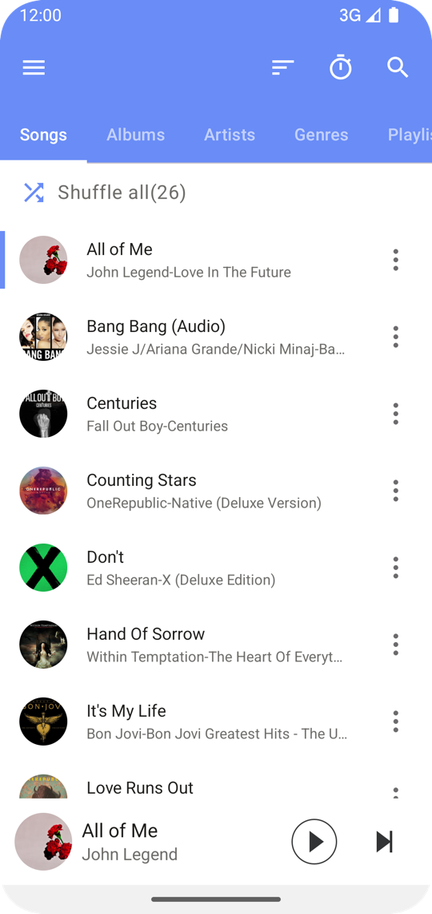 | 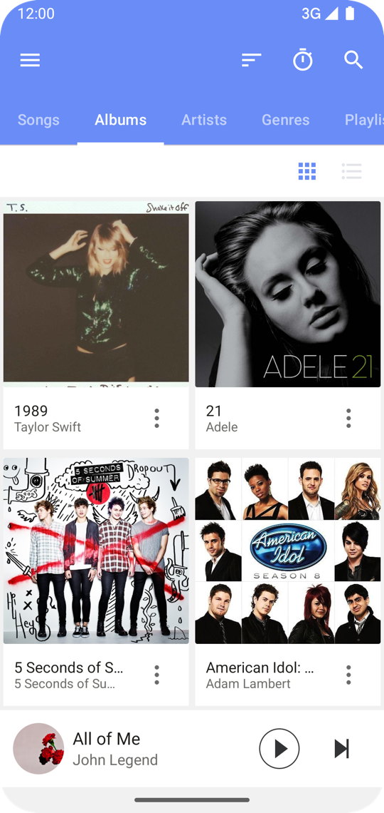 | 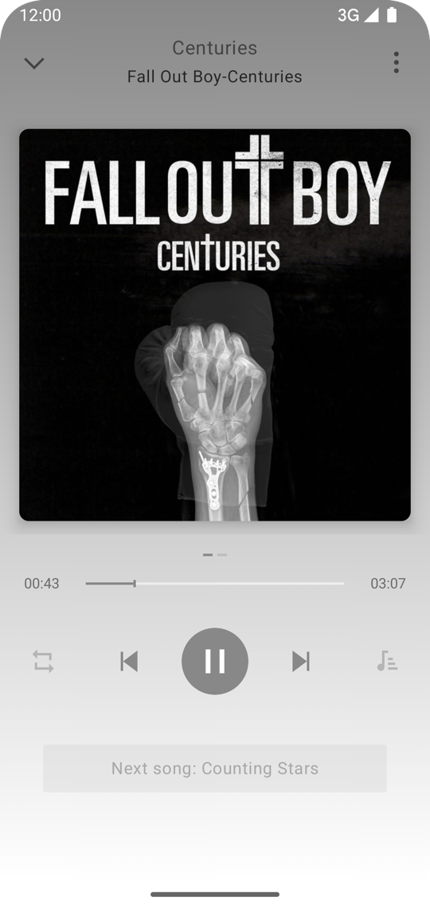 | 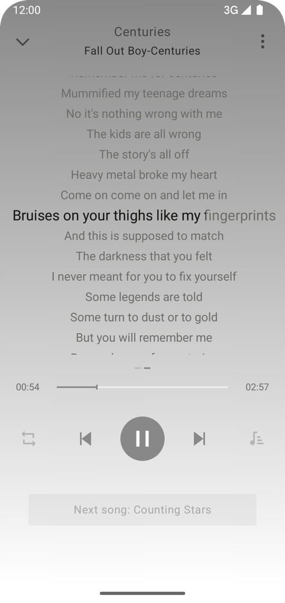 |
| 主页 | 专辑 | 播放页封面 | 播放页歌词 |

|   |   |   |   |
|:-:|:-:|:-:|:-:|
| 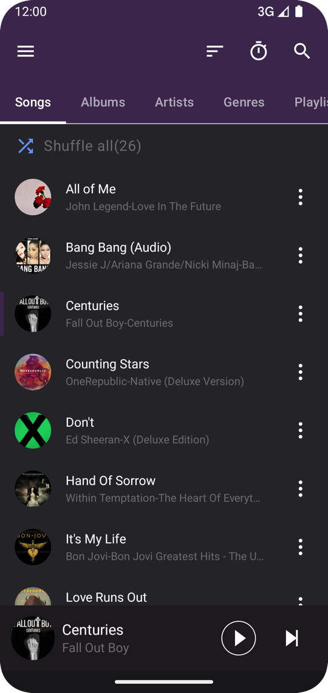 | 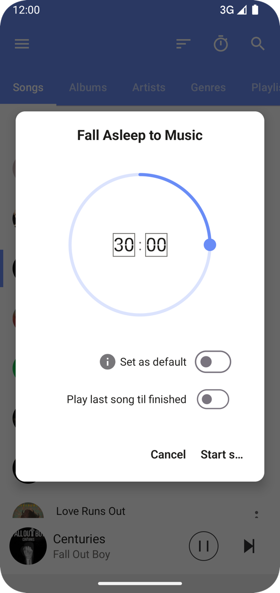 | 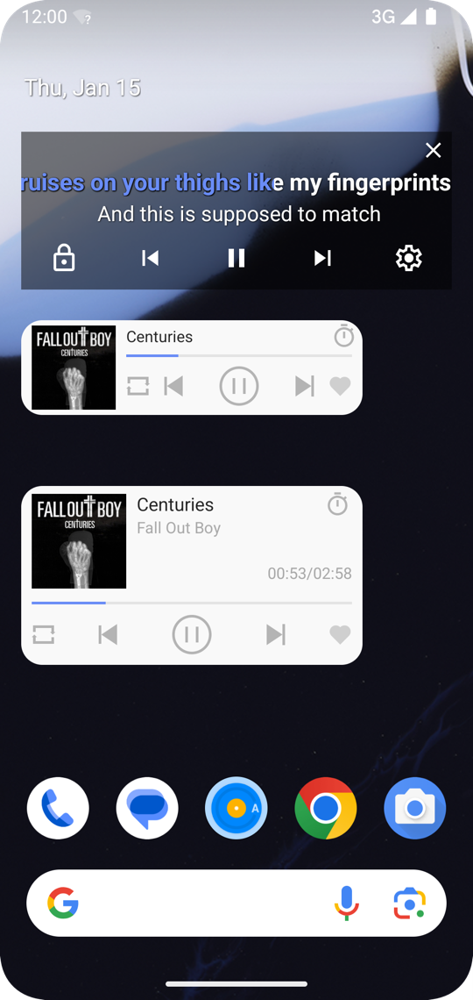 | 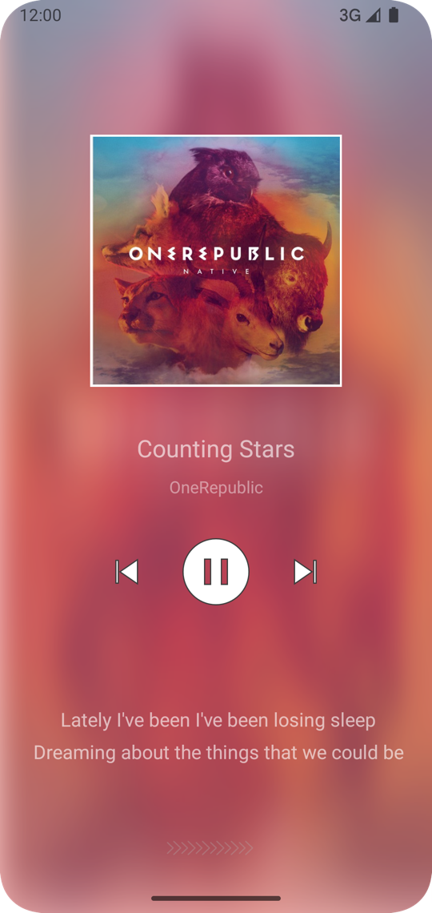 |
| 深色模式 | 睡眠定时 | 桌面 歌词 & 组件 | 锁屏 |

|   |   |   |
|:-:|:-:|:-:|
| 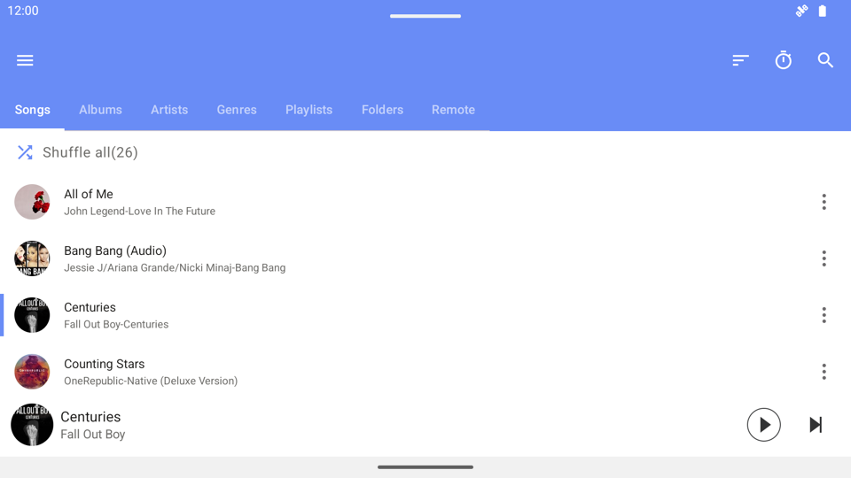 | 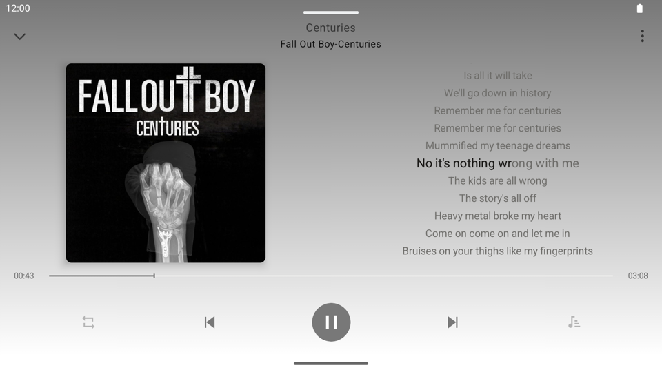 | 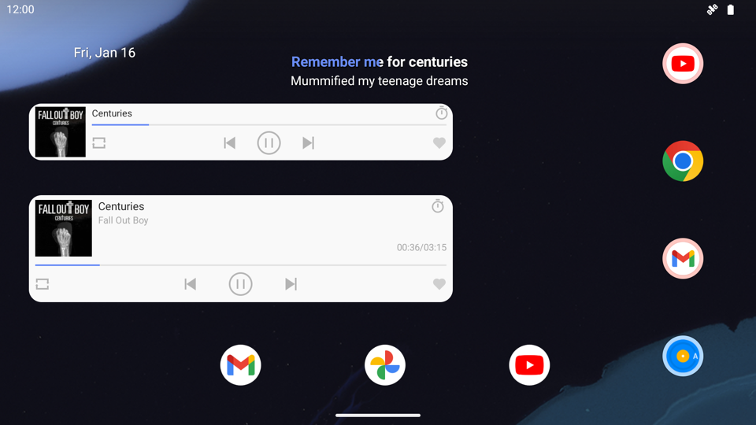 |
| 横屏主页 | 横屏播放 | 横屏桌面 歌词 & 组件 |

## 特点
- 首页 Tab 可配置：歌曲/艺术家/专辑/文件夹/播放列表/远程(WebDAV)
- 歌词体验：内嵌/本地/在线歌词(网易/酷狗/QQ)，支持逐字歌词与优先级设置
- 悬浮歌词与桌面小组件
- 主题：普通/暗色/纯黑，支持自定义主题色
- 专辑/艺术家封面自动补全
- 内置标签编辑器：标题/歌手/专辑/歌词
- 歌单管理：创建、编辑、导入、导出，支持每个歌单独立排序
- WebDAV 支持：个人云盘串流播放
- 音效与控制：均衡器、播放速度、睡眠定时
- 锁屏控制与通知栏播放控制
- 蓝牙/有线耳机按键控制
- 自动扫描媒体库，或手动扫描目录

## 感谢
- [XXPermissions](https://github.com/getActivity/XXPermissions)
- [Retrofit](https://github.com/square/retrofit)
- [Timber](https://github.com/JakeWharton/timber)
- [Leakcanary](https://github.com/square/leakcanary)
- [ImageCropper](https://github.com/CanHub/Android-Image-Cropper)
- [TinyPinyin](https://github.com/promeG/TinyPinyin)
- [Jaudiotagger for Android](https://github.com/hexise/jaudiotagger-android)

## 最后
- 如果喜欢或者能给你提供帮助，欢迎Star
- 因为是刚学安卓的时候就开始做了，很多代码待完善或者重构，还有一些待开发的功能，欢迎Pull Request
- 有任何问题可以发邮件到我的邮箱: rRemix.me@gmail.com,或者加[tg群](https://t.me/joinchat/PqrPPBbM4poRPDH7qnXxLw)
